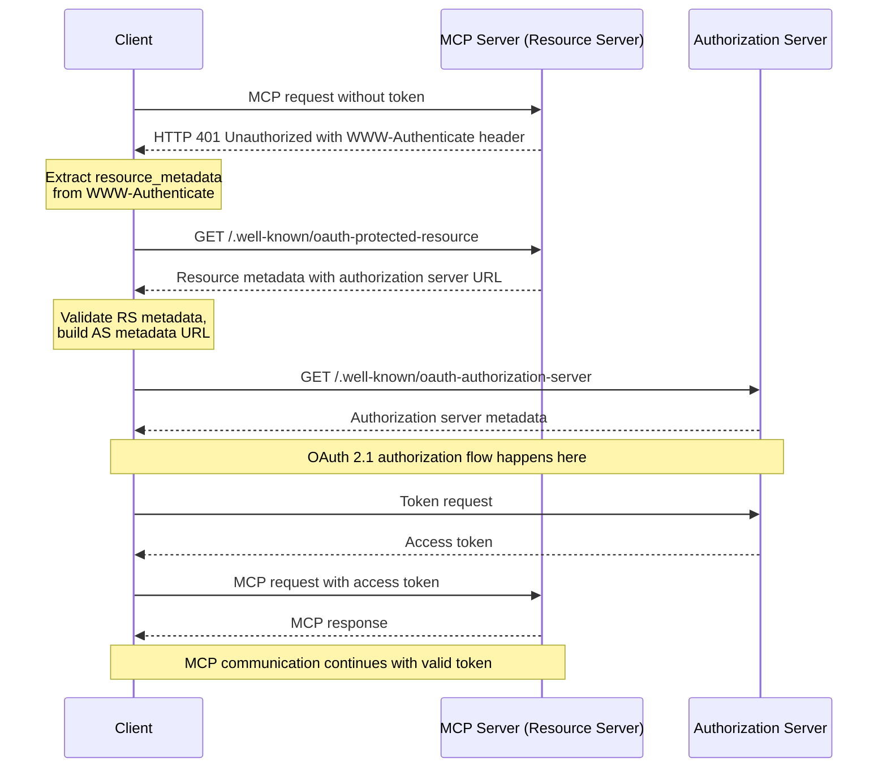

## **A clock MCP that just tells time**

*Authentication*: OAuth2.1, follows `2025-06-18` MCP specification version. 

*Recommendation*: Run `dfx canister --ic create clock` to get canister ID first. You need a permanent URI to set up your MCP server. 

I include a sequence diagram from official MCP specification here: 


### Quickstart
Create a file named `.vscode/mcp.json` inside any VS Code project directory with this content: 
```json
{
    "servers": {
        "clock": {
            "url": "https://5wbji-niaaa-aaaab-aaelq-cai.icp0.io/mcp",
        }
    }
}
```
Follow the steps VSCode guides you through to start using `Clock` MCP server in chat.
### Deployment guide
#### 1. Register your MCP server as resource server 

You could choose any OAuth provider that supports Dynamic Client Registration. Here I suggest you take a look at [Auth Canister](https://github.com/prometheus-protocol/auth-canister), a IC-native authorization server that leverages Internet Identity. Besides, it also allows you, as a resource server controller, charges user per MCP call for an amount of ICRC-1 tokens.

Here, for `Clock`, I've already setup a resource server with following information:
- **Name**: Clock MCP server
- **Resource URI**: https://5wbji-niaaa-aaaab-aaelq-cai.icp0.io/
- **Scopes**: None for simplicity. 

#### 2. Deploy your MCP server
There are required information you need to fill in to get your MCP server working correctly with MCP client:
- *metadata_url*: OAuth clients will rely on this field to locate the which authorization server it needs to talk to. This information will be returned on `WWW-Authenticate` HTTP header.
- *resource*: OAuth clients use this field to declare with authorization server which resource it needs user to grant access to. 
- *scopes*: Scopes your MCP server defines.
- *issuer*, *jwks_url*, *audience*, *authorization_server* : Use for JWT validation. Consult your OAuth provider's documentation to get these values. 

Most of the time, figuring out which value for each field could be done easily by looking at example set-up. Here is the script we use to deploy our `Clock` server:
```sh

dfx deploy clock --ic --argument '(record {
 metadata_url = "https://5wbji-niaaa-aaaab-aaelq-cai.icp0.io/.well-known/oauth-protected-resource";
 resource = "https://5wbji-niaaa-aaaab-aaelq-cai.icp0.io/mcp";
 issuer = "https://bfggx-7yaaa-aaaai-q32gq-cai.icp0.io";
 jwks_url = "https://bfggx-7yaaa-aaaai-q32gq-cai.icp0.io/.well-known/jwks.json";
 audience = "https://5wbji-niaaa-aaaab-aaelq-cai.icp0.io/mcp";
 authorization_server = vec { "https://bfggx-7yaaa-aaaai-q32gq-cai.icp0.io" };
})'
```
#### 3. Test the flow
You're done. Pick any compatible MCP client (VS Code Copilot, Anthropic MCP Inspector,...) and see if you can get the tool result alongside with your logged in identity. 

### Multi-user server
`Handler` trait's functions let you access to the authorized user through field `subject`.
